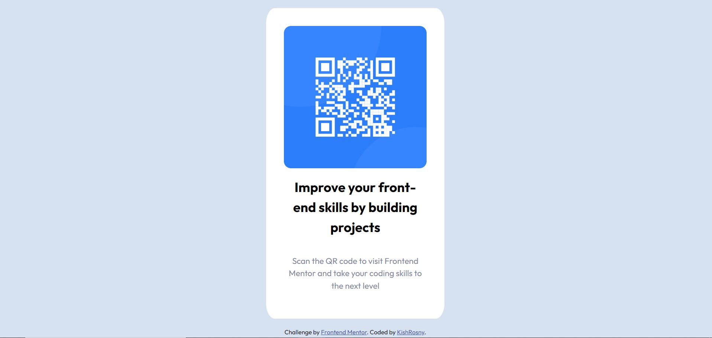

# Frontend Mentor - QR code component solution

This is a solution to the [QR code component challenge on Frontend Mentor](https://www.frontendmentor.io/challenges/qr-code-component-iux_sIO_H). Frontend Mentor challenges help you improve your coding skills by building realistic projects. 

## Table of contents

- [Overview](#overview)
  - [Screenshot](#screenshot)
  - [Links](#links)
- [My process](#my-process)
  - [Built with](#built-with)
  - [What I learned](#what-i-learned)
  - [Continued development](#continued-development)

## Overview

### Screenshot

### Links

- Solution URL: [Add solution URL here](https://your-solution-url.com)
- Live Site URL: https://kishrrk19.github.io/frontend-mentor-qrcode/

## My process

### Built with

- Semantic HTML5 markup
- CSS custom properties

### What I learned

-I learned how to use height for .container and elements. I should not use max-hight for container and it's better to fix the hight for elements.
-I should use min-height: 100vh; for container. The container automatically expands to match the height of the viewport, allowing the content to be fully displayed. 
-I should not use pixel for font-size and use rem.

### Continued development

I need to continue same kind of chalenge, using CSS.
